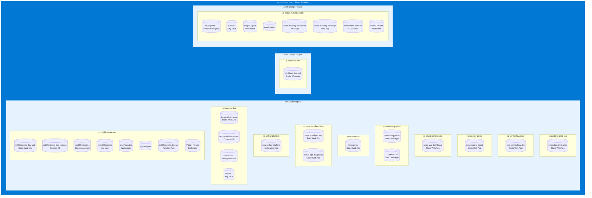
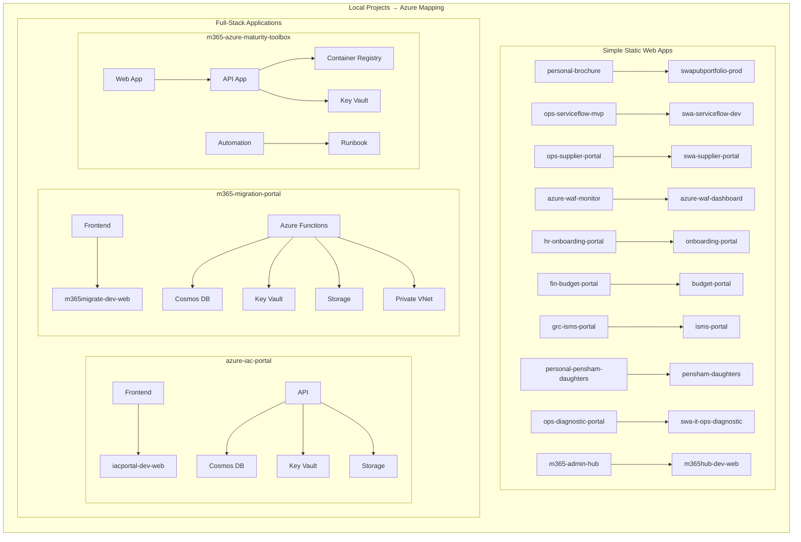
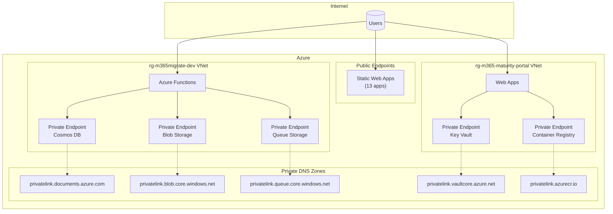

# Azure Environment Architecture

> Generated: 2026-02-01
> Subscription: Azure subscription 1 (Fintel Sandbox)

## Overview Diagram

## Detailed Resource Diagram

## Resource Summary

| Resource Type | Count | Locations |
|---------------|-------|-----------|
| **Static Web Apps** | 13 | West Europe |
| **Web Apps** | 3 | North Europe, West Europe |
| **Function Apps** | 1 | West Europe |
| **Cosmos DB** | 2 | UK South |
| **Storage Accounts** | 2 | UK South |
| **Key Vaults** | 3 | UK South, North Europe |
| **Container Registry** | 1 | North Europe |
| **Virtual Networks** | 2 | West Europe, North Europe |
| **Log Analytics** | 2 | UK South, North Europe |
| **App Insights** | 2 | West Europe, North Europe |
| **Automation Accounts** | 1 | North Europe |

## Project to Azure Mapping

| Local Project | Azure Resource | Resource Group | Type |
|---------------|---------------|----------------|------|
| personal-brochure | swapubportfolio-prod | rg-portfolio-prod-uks | Static Web App |
| ops-serviceflow-mvp | swa-serviceflow-dev | rg-serviceflow-mvp | Static Web App |
| ops-supplier-portal | swa-supplier-portal | rg-supplier-portal | Static Web App |
| azure-waf-monitor | azure-waf-dashboard | rg-azwaf-portal-demo | Static Web App |
| hr-onboarding-portal | onboarding-portal | rg-onboarding-portal | Static Web App |
| fin-budget-portal | budget-portal | rg-onboarding-portal | Static Web App |
| grc-isms-portal | isms-portal | rg-isms-portal | Static Web App |
| personal-pensham-daughters | pensham-daughters | rg-pensham-daughters | Static Web App |
| ops-diagnostic-portal | swa-it-ops-diagnostic | rg-pensham-daughters | Static Web App |
| m365-admin-hub | m365hub-dev-web | rg-m365hub-dev | Static Web App |
| azure-iac-portal | iacportal-dev-* | rg-iacportal-dev | Full Stack |
| m365-migration-portal | m365migrate-dev-* | rg-m365migrate-dev | Full Stack |
| m365-azure-maturity-toolbox | m365-maturity-portal-* | rg-m365-maturity-portal | Full Stack |

## Network Architecture

## Cost Optimization Notes

- **Static Web Apps**: Most apps use the Free tier - consider Standard for production
- **Cosmos DB**: Using serverless/provisioned - monitor RU consumption
- **Private Endpoints**: Each incurs hourly cost - consolidate where possible
- **Container Registry**: Basic tier - upgrade for geo-replication if needed

## Security Features

- ✅ Private Endpoints for Cosmos DB, Storage, Key Vault, ACR
- ✅ Virtual Networks with proper subnet segmentation
- ✅ Key Vault for secrets management
- ✅ App Insights for monitoring
- ⚠️ Consider: Azure Front Door for WAF protection on Static Web Apps
- ⚠️ Consider: Managed Identities for all app-to-resource connections
