# Azure Environment Architecture

> Generated: 2026-02-01
> Subscription: Azure subscription 1 (Fintel Sandbox)

## Overview Diagram

## Detailed Resource Diagram

## Resource Summary

| Resource Type | Count | Locations |
|---------------|-------|-----------|
| **Static Web Apps** | 13 | West Europe |
| **Web Apps** | 3 | North Europe, West Europe |
| **Function Apps** | 1 | West Europe |
| **Cosmos DB** | 2 | UK South |
| **Storage Accounts** | 2 | UK South |
| **Key Vaults** | 3 | UK South, North Europe |
| **Container Registry** | 1 | North Europe |
| **Virtual Networks** | 2 | West Europe, North Europe |
| **Log Analytics** | 2 | UK South, North Europe |
| **App Insights** | 2 | West Europe, North Europe |
| **Automation Accounts** | 1 | North Europe |

## Project to Azure Mapping

| Local Project | Azure Resource | Resource Group | Type |
|---------------|---------------|----------------|------|
| personal-brochure | swapubportfolio-prod | rg-portfolio-prod-uks | Static Web App |
| ops-serviceflow-mvp | swa-serviceflow-dev | rg-serviceflow-mvp | Static Web App |
| ops-supplier-portal | swa-supplier-portal | rg-supplier-portal | Static Web App |
| azure-waf-monitor | azure-waf-dashboard | rg-azwaf-portal-demo | Static Web App |
| hr-onboarding-portal | onboarding-portal | rg-onboarding-portal | Static Web App |
| fin-budget-portal | budget-portal | rg-onboarding-portal | Static Web App |
| grc-isms-portal | isms-portal | rg-isms-portal | Static Web App |
| personal-pensham-daughters | pensham-daughters | rg-pensham-daughters | Static Web App |
| ops-diagnostic-portal | swa-it-ops-diagnostic | rg-pensham-daughters | Static Web App |
| m365-admin-hub | m365hub-dev-web | rg-m365hub-dev | Static Web App |
| azure-iac-portal | iacportal-dev-* | rg-iacportal-dev | Full Stack |
| m365-migration-portal | m365migrate-dev-* | rg-m365migrate-dev | Full Stack |
| m365-azure-maturity-toolbox | m365-maturity-portal-* | rg-m365-maturity-portal | Full Stack |

## Network Architecture

### High-Level Network Overview

### Detailed VNet Architecture

### Private Endpoint Connectivity

### Network Resource Inventory

| Resource | Type | Location | Address Space | Connected To |
|----------|------|----------|---------------|--------------|
| **m365migrate-dev-vnet-y7xmaa** | VNet | West Europe | 10.0.0.0/16 | - |
| ├─ functions-subnet | Subnet | West Europe | 10.0.1.0/24 | Azure Functions |
| └─ privatelink-subnet | Subnet | West Europe | 10.0.2.0/24 | Private Endpoints |
| **m365-maturity-portal-vnet** | VNet | North Europe | 10.0.0.0/16 | - |
| ├─ private-endpoints | Subnet | North Europe | 10.0.1.0/24 | Private Endpoints |
| └─ app-services | Subnet | North Europe | 10.0.2.0/24 | Web Apps |

### Private Endpoint Details

| Private Endpoint | Resource Group | Target Resource | Target Type | Subnet |
|------------------|----------------|-----------------|-------------|--------|
| m365migrate-dev-cosmos-pe | rg-m365migrate-dev | m365migrate-dev-cosmos | Cosmos DB | privatelink-subnet |
| m365migrate-dev-storage-pe-blob | rg-m365migrate-dev | stm365migrate | Storage (Blob) | privatelink-subnet |
| m365migrate-dev-storage-pe-queue | rg-m365migrate-dev | stm365migrate | Storage (Queue) | privatelink-subnet |
| m365kv-pe | rg-m365-maturity-portal | m365kv | Key Vault | private-endpoints |
| m365portal-pe | rg-m365-maturity-portal | m365portal | Container Registry | private-endpoints |

### Private DNS Zones

| DNS Zone | Resource Group | Linked VNets | Purpose |
|----------|----------------|--------------|---------|
| privatelink.documents.azure.com | rg-m365migrate-dev | m365migrate-dev-vnet | Cosmos DB |
| privatelink.blob.core.windows.net | rg-m365migrate-dev | m365migrate-dev-vnet | Blob Storage |
| privatelink.queue.core.windows.net | rg-m365migrate-dev | m365migrate-dev-vnet | Queue Storage |
| privatelink.vaultcore.azure.net | rg-m365-maturity-portal | m365-maturity-portal-vnet | Key Vault |
| privatelink.azurecr.io | rg-m365-maturity-portal | m365-maturity-portal-vnet | Container Registry |

### Network Security Posture

```mermaid
flowchart LR
    subgraph Public["Public Internet"]
        USER[("Users")]
    end

    subgraph Edge["Edge Security"]
        SWA_SEC["Static Web Apps<br/>Built-in DDoS<br/>TLS 1.2+"]
    end

    subgraph AppLayer["Application Layer"]
        FUNC_SEC["Azure Functions<br/>Auth/AuthZ<br/>Managed Identity"]
        WEB_SEC["Web Apps<br/>Auth/AuthZ<br/>Managed Identity"]
    end

    subgraph DataLayer["Data Layer (Private Only)"]
        COSMOS_SEC["Cosmos DB<br/>🔒 Private Endpoint Only<br/>RBAC Enabled"]
        KV_SEC["Key Vault<br/>🔒 Private Endpoint Only<br/>RBAC Enabled"]
        STORAGE_SEC["Storage<br/>🔒 Private Endpoint Only<br/>Encryption at Rest"]
        ACR_SEC["Container Registry<br/>🔒 Private Endpoint Only<br/>Content Trust"]
    end

    USER --> SWA_SEC
    USER --> FUNC_SEC
    USER --> WEB_SEC

    FUNC_SEC -->|"Private Link"| COSMOS_SEC
    FUNC_SEC -->|"Private Link"| STORAGE_SEC
    WEB_SEC -->|"Private Link"| KV_SEC
    WEB_SEC -->|"Private Link"| ACR_SEC

    style Public fill:#ffebee
    style Edge fill:#e8f5e9
    style AppLayer fill:#e3f2fd
    style DataLayer fill:#f3e5f5
```

### Network Recommendations

| Area | Current State | Recommendation | Priority |
|------|---------------|----------------|----------|
| **VNet Peering** | No peering between VNets | Consider peering if cross-region communication needed | Low |
| **NSGs** | Not detected | Add NSGs to subnets for granular traffic control | Medium |
| **Azure Firewall** | Not deployed | Consider for centralized egress control | Low |
| **DDoS Protection** | Standard (platform) | Consider DDoS Protection Standard for production | Medium |
| **Private DNS** | Configured per VNet | Consider centralized Private DNS Hub | Low |
| **Service Endpoints** | Not used | Already using Private Endpoints (better) | N/A |

## Cost Optimization Notes

- **Static Web Apps**: Most apps use the Free tier - consider Standard for production
- **Cosmos DB**: Using serverless/provisioned - monitor RU consumption
- **Private Endpoints**: Each incurs hourly cost - consolidate where possible
- **Container Registry**: Basic tier - upgrade for geo-replication if needed

## Security Features

- ✅ Private Endpoints for Cosmos DB, Storage, Key Vault, ACR
- ✅ Virtual Networks with proper subnet segmentation
- ✅ Key Vault for secrets management
- ✅ App Insights for monitoring
- ⚠️ Consider: Azure Front Door for WAF protection on Static Web Apps
- ⚠️ Consider: Managed Identities for all app-to-resource connections
